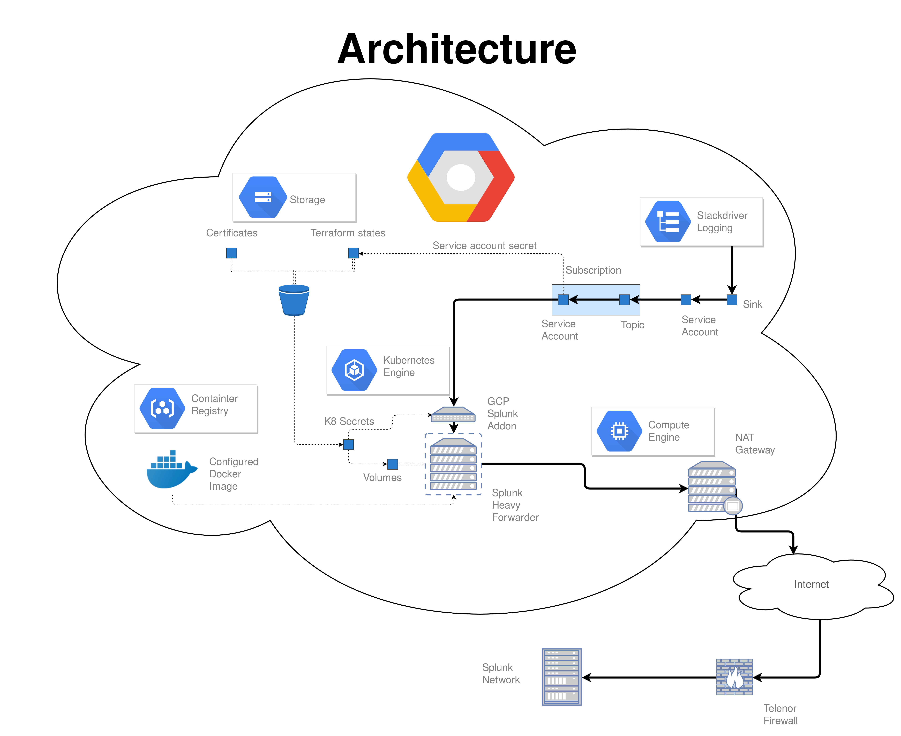

# GCP\_Splunk\_bridge

## Description
A Splunk forwarder, ready to transfer logs from Google Stackdriver Logging to a receiving Splunk network.

## Prerequisites
* Helm
* Terraform 
* Gcloud and kubectl 
* A GCP kubernetes cluster in the project which will have its logs transferred
* Splunk Enterprise certificates 

## Usage
1. Deploy the NAT gateway and the pubsub setup using their respective terraforms. Remember to adjust the variables in values.tf to fit your project, and make sure that the NAT Gateway is assigned a reserved static IP. 
2. Retrieve the Splunk certificates (not included here) and deploy them as secrets. (TODO: details)
3. Build and add the supplied Splunk image to your GCP Container Registry.
4. Deploy the Forwarder using the helmchart. 

## Architecture

## Troubleshooting

### The Forwarder is stuck in a pending state
Make sure the pubsub setup has been applied correctly. GCP pods will wait indefinitely if a required resource, such as a secret, is missing. 
